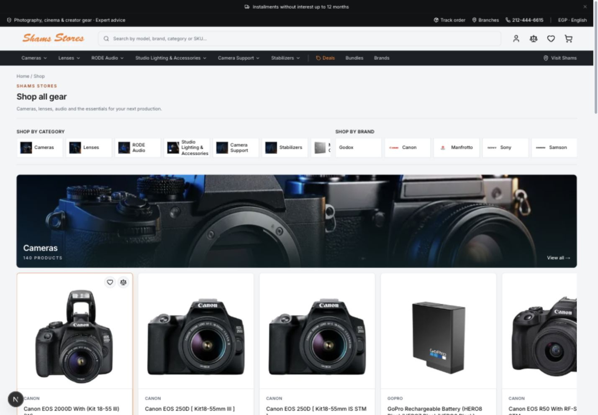
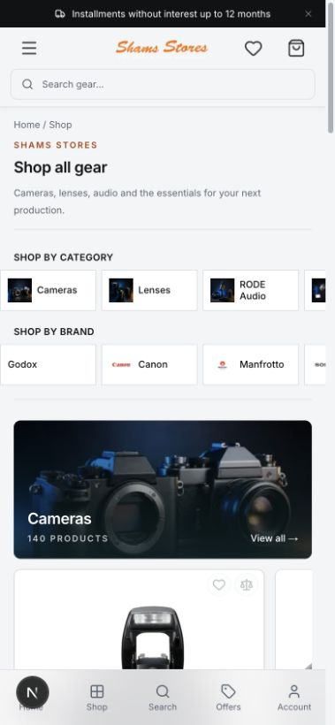
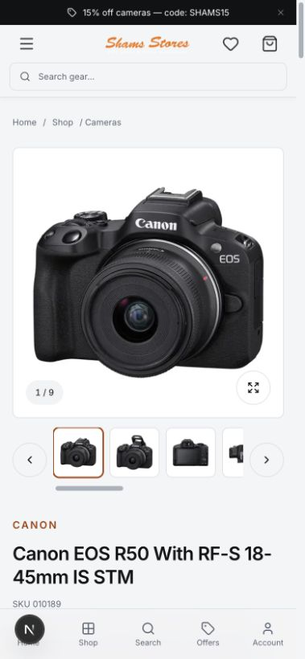
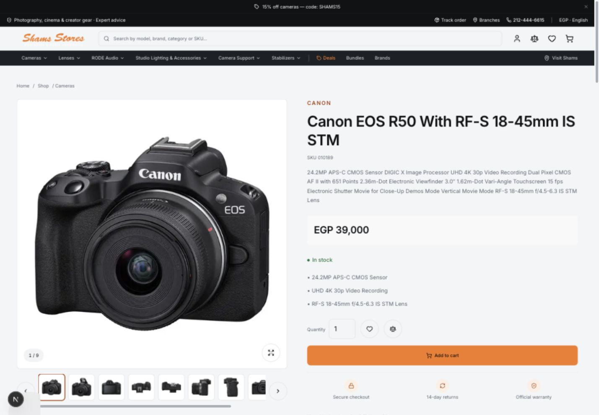

# خطة تطوير Shams Stores Headless وربط API

تاريخ المراجعة: 19 سبتمبر 2026. هذه وثيقة التخطيط الأصلية. تم تنفيذ جزء الربط والتحسينات الأساسية لاحقًا؛ راجع HEADLESS-IMPLEMENTATION-2026-09-19.md للحالة الفعلية والتحقق والحدود المتبقية.

## النتيجة والاتجاه

الأساس الحالي مناسب للاستمرار: Next.js، طبقة تجارة منفصلة، مسارات خادم وسيطة، صور منتجات واضحة، وهوية برتقالي/فحمي مميزة. الأولوية هي تصحيح مصدر البيانات وصدق المحتوى، ثم تحسين ترتيب الشراء على الموبايل وتوحيد التفاعل. نحافظ على شعار شمس المكتوب وشكل الكتالوج المعتمد؛ لا نحتاج إعادة بناء المشروع أو إضافة framework.

الهدف: العميل يكتشف منتجًا، يعرف سعره وتوفره وضمانه وصفة الوكيل بدقة، يختار إكسسوارات متوافقة، ثم يكمل الطلب برسائل تحقق واضحة. ووردبريس يملك بيانات التجارة والمحتوى؛ الـ headless يملك العرض والتفاعل.

## نطاق المراجعة وحدودها

- قراءة البنية، التطبيع، جلب البيانات، المنتج، الرئيسية، الهيدر والفوتر، السلة/الدفع، المصادقة والمفضلة، CSS، التوثيق والاختبارات.
- مشاهدة النسخة المحلية localhost:3000 ببيانات متجر، وتصوير الرئيسية والكتالوج والمنتج بعرض 1440 و390 بكسل. الصور تم التقاطها وفحصها خلال هذه المراجعة.
- الهوفر راجعته من قواعد CSS؛ لم أنفذ اختبار مؤشر كامل لكل عنصر. عرض الموبايل ليس اختبار جهاز لمس فعليًا.
- لا اختبار دفع فعلي، إنشاء طلب، حساب مسجل، أو قياس Lighthouse/Core Web Vitals. التابلت واللابتوب وRTL ضمن قبول التنفيذ القادم، وليس نتائج مُثبتة هنا.
- طلب قراءة عام إلى `/wp-json/shams/v1/modules` أعاد HTTP 403؛ هذا لا يثبت غياب الإصدار 0.8.0 ولا وجوده. يجب التحقق من بيئة staging ومسار الحماية قبل الربط الفعلي.
- `pnpm test`: 29 اختبارًا ناجحًا. `pnpm typecheck`: ناجح. لم يُشغّل production build لأن هذه المرحلة مراجعة وتوثيق، وليس تغيير تطبيق.
- هناك تعديلات سابقة للمالك في `checkout-form.tsx` و`mobile-navigation.tsx`؛ لم تُعدّل أو تُلغَ.

## رحلة مصورة: الحالة الحالية

| الخطوة | الشاشة | الحالة | الدليل والاستنتاج |
|---|---|---|---|
| 1 | الرئيسية Desktop | أساس بصري جيد، محتوى يحتاج ضبط | الهيدر والشعار واضحان. حملات ثابتة وعنوان منتج يكرر اسم الماركة؛ نافذة الموافقة ظاهرة في لقطة الزيارة الأولى |
| 2 | المتجر Desktop | يحتاج تحسين الأولويات | اكتشاف الأقسام والماركات واضح؛ منتجات غير متاحة تتصدر بعض المجموعات |
| 3 | المتجر Mobile | يحتاج تقليل المسافة للشراء | الهيدر والبحث وشرائط الفئات والماركات والبانر تؤخر ظهور سعر أول منتج |
| 4 | المنتج Mobile | يحتاج إعادة ترتيب | المعرض والصور المصغرة يستهلكان معظم أول شاشة؛ السعر والقرار الشرائي يأتيان متأخرين |
| 5 | المنتج Desktop | قوي بصريًا، مشكلة ثقة في البيانات | صورة واضحة وزر شراء بارز؛ ضمان رسمي وإرجاع 14 يومًا معروضان كرسائل ثابتة |

### 1 — الرئيسية

### 2 — المتجر Desktop

### 3 — المتجر Mobile

### 4 — المنتج Mobile

### 5 — المنتج Desktop

## المشكلات مرتبة بالأولوية

### P0 — عقد البيانات والثقة

1. **الضمان والوكيل غير مربوطين بالمصدر الصحيح.** `lib/commerce/live/normalize.ts` يستخدم `_shams_official`، بينما العقد الجديد يعرض `_shams_authorized` وحالة/عنوان الوكيل. الضمان الحالي يُختصر من `_shams_product_warranty` ولا يحفظ كل نص الضمان الحقيقي. `live-product-detail.tsx` يعرض Official warranty بشكل ثابت. نستخدم `assurances` القادمة من المصدر، مع تمييز false وnull وعدم اختراع مدة أو اسم شركة.
2. **الإكسسوارات الحالية ليست نتائج محرك التوافق.** `catalog.ts` يقرأ manual includes بشروط محلية، ويستخدم cross-sells للإكسسوارات. نربط endpoint المحرك، ونحتفظ بدرجة التوافق وسببه ومصدره، ونفصل المتوافق عن related/alternatives. لا ننسب توافقًا لمجرد تشابه الفئة.
3. **تعارض محتمل على wishlist.** بلاجن `wordpress-plugin/shams-headless` وCommerce UX يسجلان GET/POST على `/shams/v1/wishlist`. الأول يستخدم Bearer ومفتاح `shams_wishlist` واستجابة `products`؛ الثاني جلسة ووردبريس ومفتاح `_shams_wishlist_product_ids` واستجابة `product_ids`. يلزم حسم مالك المسار، adapter متوافق أو namespace واضح، وخطة دمج بيانات تحفظ القائمتين. الأثر الفعلي يعتمد على البلاجنات النشطة وترتيب تسجيلها، ولم يُثبت على الإنتاج. مسار `/api/customer/wishlist` يخفي بعض الأخطاء كقائمة فارغة؛ نفصل الخطأ عن عدم وجود عناصر.
4. **الدفع مستقل عن فورم ووردبريس.** `requiredFields` في `checkout-form.tsx` يحتوي phone صراحة. API 0.8.0 الجديد لا يتضمن schema حقول الدفع؛ لا يصح الادعاء أن الإعدادات ستنتقل تلقائيًا. نحتاج عقدًا محدودًا يقرأ إعدادات مالك الحقول الفعلي ويغذي التحقق في العميل والخادم. الهاتف إجباري حسب أحدث تأكيد من المالك أثناء المراجعة؛ نتحقق من وجوده وصحته، مع مراجعة الصيغ المقبولة ومتطلبات بوابة الدفع نفسها. وجود phone في requiredFields متوافق مع هذا القرار، والمطلوب توحيد مصدر الإعدادات وسلوك رسائل التحقق. لا نعطل الزر لمجرد نقص الحقول؛ الضغط يظهر الأخطاء ويركز أول حقل ناقص. منع تكرار الطلب أثناء إرساله فعليًا يظل حماية منفصلة، مع تفسير حالات عدم توفر وسيلة الدفع/الشحن.
5. **ادعاءات تجارية ثابتة وأرقام اتصال مختلفة.** في theme/الهيدر/الفوتر/JSON-LD توجد أرقام غير متطابقة، وعروض خصم وشحن مجاني وتقسيط وإرجاع. يجب ربطها بمحتوى معتمد أو إخفاؤها؛ لا تثبيتها كسياسة متجر بلا مصدر.

### P1 — الاكتشاف والتحويل

- الهيرو لا يضمن توفر المنتج؛ ظهر منتج غير متاح ضمن اختيار الرئيسية. نختار حملة متاحة من المحتوى المُدار، مع بديل محايد عند غيابها.
- تعبير trending/this week لا يطابق بالضرورة مصدر best-selling. نعرض اسمًا يصف البيانات الفعلية.
- على الموبايل: اسم مختصر، سعر وتوفر، صورة مناسبة، ضمان/وكيل، كمية وإضافة، ثم التفاصيل والإكسسوارات. يمكن شريط شراء ثابت بعد مغادرة منطقة الشراء، مع منع تداخله مع شريط التنقل.
- تقليل تكرار مجموعات الرئيسية؛ كل مجموعة لها وظيفة: اكتشاف، منتجات مختارة، إكمال تجهيز، زيارة فرع. لا نكرر نفس المنتجات بعناوين متعددة.
- روابط Read guide تذهب حاليًا لفئات في بعض المواضع؛ نربطها بمقال فعلي أو نعيد التسمية إلى تصفح الفئة.

### P2 — الاتساق وإتاحة الاستخدام

- قواعد hover موزعة بين Button العام و`.shams-button` وكروت المنتجات، وبها ألوان حدود متنافسة؛ نجعل token واحدًا وحالة واحدة لكل component.
- أدوات الكروت المخفية تظهر عبر hover؛ لا يوجد focus-within مكافئ في القاعدة المعنية. نضيف ظهورًا للوحة المفاتيح ونختبر ترتيب التركيز وعدم الوصول لزر غير مرئي.
- تعديل المالك الجاري أزال activeClass من تنقل الموبايل؛ نعيد علامة الموقع الحالي بتصميم متفق مع التعديل، دون إلغاء شغله تلقائيًا.
- التطبيق حاليًا English و`lang=en`. العربية تحتاج طبقة ترجمة واتجاه كاملة، وليس تبديل العناوين فقط.
- مراجعة تكرار Skip to content وربط التركيز بـ main، وأهداف لمس تقارب 44px، ووضوح الخطأ بدون الاعتماد على اللون وحده.

## مكان كل بيانات API في الواجهة

كل المسارات التالية تحت `/wp-json/shams/v1`. البيانات تمر بطبقة الخادم الحالية؛ لا مفاتيح WooCommerce في المتصفح.

| المصدر | مكان العرض | التنفيذ المقترح وحالات الغياب |
|---|---|---|
| `/products/{id}/content` → assurances | بجوار السعر على صفحة المنتج، وتفاصيل الضمان أسفلها | `normalize.ts` و`types.ts` و`live-product-detail.tsx`. عرض label فقط عندما enabled؛ null يعني غير معروف، وليس نفي وجود ضمان |
| `/products/content?ids[]=...` | بطاقات المتجر/البحث/المفضلة والمقارنة | إثراء دفعات المنتجات مرة على الخادم ودمج بالـ id. الحد 20، بينما القوائم قد تجلب 24–40؛ تقسيم دفعات، وليس request لكل كارت |
| `/products/{id}/accessories` | قسم «إكسسوارات متوافقة مع المنتج» بعد منطقة الشراء والتفاصيل المهمة | `catalog.ts` + قسم المنتج. عرض level/note، مع رابط المنتج والشراء العادي. لو لا نتائج نخفي القسم؛ فشل الخدمة لا يمنع المنتج الأساسي |
| `/products/{id}/content` → fields/linked_products | المواصفات والمحتوى والمنتجات المرتبطة | عرض الحقول المعروفة فقط، وتحويل الروابط إلى مسارات headless؛ عدم عرض مفاتيح داخلية كعناوين للعميل |
| `/site-content` → shell/menus/branches | الهيدر والفوتر والتنقل وصفحة الفروع | مصدر واحد للتليفون والعنوان والروابط. تحقق من schema والروابط. null يحافظ على fallback موثق؛ لا قوائم فارغة بدل التنقل كله |
| `/site-content` → hero_carousel/shoppable_hero | الهيرو الرئيسي ومناطق المنتجات التفاعلية | استهلاك السلايدات النشطة فقط؛ صور responsive ونص بديل وروابط صحيحة؛ لا تشغيل كاروسيل وحملة بديلة متنافسين |
| `/site-content` → commerce_ui | النصوص والعناصر العامة المدعومة | تطبيق allowlist محدد، لا حقن إعدادات أو CSS ووردبريس كاملة في Next |
| `/catalog/terms` | اكتشاف الأقسام والماركات وصفحاتها | الصور والأسماء والوصف من المصدر. لا نعامل ترتيب taxonomy كترتيب تحرير معتمد؛ نحافظ على ترتيب القوائم المعتمد حتى يتوفر له مصدر |
| `/pages/{id}/content` | صفحات المحتوى والسياسات المتفق عليها | خريطة id/slug، تنظيف HTML، تحويل الروابط، fallback عند 404؛ لا نشر سياسات مجهولة تلقائيًا |
| seo_overrides | metadata لكل صفحة/منتج | دمج القيم المحفوظة مع fallback الحالي؛ هذه overrides وليست SEO محلولًا كاملًا. canonical وOG يشيران للـ headless |
| `/modules` | فحص صحة التكامل وتشخيص المطور | لا يظهر كقائمة بلاجنات للعميل، ولا يحمل في كل كارت |
| `/admin/modules` | أدوات إدارية محمية فقط عند الحاجة | لا يستدعيه storefront العام؛ لا مشاركة credentials إدارية مع العميل |
| search/branch-stock الموجودة | البحث وتوفر الفروع | نحتفظ بالتكامل الحالي ونختبر اتساقه مع العقود الجديدة |
| customer/auth/orders/wishlist الموجودة | الحساب والمفضلة وتتبع طلب العميل | تثبيت ملكية وصلاحيات العقود؛ لا توصيل Orders Hub الخاص بالموظفين إلى حساب العميل |

**حدود مهمة:** إتاحة البلاجن في API لا تنقل CSS أو JavaScript أو كل شاشة إدارية إلى headless. لكل وظيفة عميل مكان مقصود. اسم شركة الوكيل الحقيقي لا يُستنتج من badge label؛ يُعرض فقط إن توفر حقل موثوق له.

## تصميم طبقة الربط

1. إضافة وحدة `lib/commerce/live/shams-content.ts` للطلبات الجديدة وأنواع transport منفصلة عن ProductSummary؛ إعادة استخدام العميل الحالي.
2. دوال تطبيع نقية تحول البيانات إلى assurances/accessory recommendations/site shell داخل أنواع المشروع الحالية. فصل `unknown` عن `false` وعن غياب plugin.
3. دمج enrichment بالـ id؛ استجابة API الجديدة لا تحتوي slug كافيًا لكل مسارات المنتج، لذلك لا نستبدل ProductSummary بها مباشرة. تحويل روابط WordPress إلى `/p/` و`/c/` و`/b/` من خريطة موثوقة.
4. عدم نسخ TTL الحالي تلقائيًا: endpoints الجديدة no-store وقد تتضمن سعرًا/مخزونًا. المحتوى الثابت يمكن فصله وتخزينه لاحقًا بعقد واضح، مع إعادة تحقق السلة عند الشراء دائمًا.
5. تحميل البيانات المستقلة بالتوازي، ومنع فشل endpoint اختياري من إسقاط الصفحة؛ تسجيل خطأ مفهوم دون بيانات عميل أو أسرار. لا تحويل كل 401/403/500 إلى بيانات فارغة صامتة.
6. الـ BFF يحافظ على authentication وCart-Token وسياسة cookies الحالية. تنظيف HTML من صفحات ووردبريس والتحقق من الوجهات الخارجية.
7. اختبارات عقود fixtures: missing plugin، null، false، نص عربي، منتج مخفي، دفعة 40 عنصرًا، استجابة جزئية، timeout، slug مفقود، وعدم تكرار طلب لكل كارت.

## الألوان والهوفر وقوة البراند

التوصية: الاحتفاظ بالبرتقالي والشعار والفحمي، وتقوية الاتساق والمصداقية والصور. لا نحتاج تغيير الهوية إلى لون جديد.

| الدور | اللون الموجود | القرار |
|---|---|---|
| Primary/brand | `#F47A20` | زر الشراء والإجراء الأساسي واللمسات المهمة |
| كتابة فوق primary | `#1C1006` | يحتفظ بها؛ تباين محسوب 6.79:1 مع البرتقالي |
| Hover primary | `#DC6815` | توحيده؛ الكتابة الغامقة عليه 5.36:1 |
| Active primary | `#C75A0D` | حالة ضغط قصيرة بلا تغيير مقاسات |
| روابط ونصوص براند | `#A54108` | على الأبيض تباين 6.25:1، أنسب من البرتقالي الفاتح للنص الصغير |
| النص الأساسي | `#101214` | يبقى واضحًا على الأسطح الفاتحة |
| النص الثانوي | `#5B6472` | على الأبيض 5.98:1؛ لا نخففه أكثر بلا قياس |
| الخلفية/السطح | `#F4F5F6` / أبيض | يبقيان مساحة هادئة لصورة المنتج |
| الهيدر الداكن | `#1C2024` | حضور متخصص ثابت مع الشعار البرتقالي |
| نجاح/خطأ | `#13773D` / `#C9362B` | للمخزون والحالات، مع نص/أيقونة توضح المعنى |

البرتقالي `#F47A20` مع الأبيض تباينه 2.74:1؛ لا نستخدم كتابة بيضاء صغيرة عليه ولا نصًا برتقاليًا فاتحًا صغيرًا على أبيض. الحسابات للألوان الصلبة المذكورة، وليست شهادة امتثال لكل حالات الموقع أو الخلفيات المصورة.

قواعد التفاعل المقترحة:

- زر أساسي برتقالي، ثانوي outline، وثالث رابط واضح. «إضافة للسلة» أقوى بصريًا من المفضلة والمقارنة.
- hover يغير اللون/الحد فقط؛ تكبير صورة المنتج بحد 1.025 الموجود وبلا تحريك layout.
- الاحتفاظ بمدد الحركة الموجودة 140–220ms للتفاعل و280ms للطبقات، مع احترام reduced motion.
- focus-visible واضح مستقل عن hover، وfocus-within يكشف أدوات البطاقة؛ أدوات اللمس لا تعتمد على المرور بالمؤشر.
- disabled حالة فعلية مفسرة، وليس وسيلة لإخفاء سبب تعذر الشراء. أخطاء الحقول inline ومع ملخص مناسب.
- active nav ظاهر، والروابط visited/selected لا تختلط بالمخزون أو العروض.

لتقوية البراند: صور تجهيزات واستخدام حقيقية أو حملة معلّمة بوضوح، عناوين قصيرة متخصصة، ضمان ووكيل من بيانات فعلية، تواصل وفروع متسقة، إزالة التكرار ووعود الخصم غير الموثقة. لا نستبدل الشعار المكتوب، ولا نكدس البرتقالي على كل الحدود والأزرار. صورة OG مخصصة للمشاركة بدل استخدام أيقونة 192×192 كصورة كبيرة.

## خطة التنفيذ والتسليم

| المرحلة | العمل | المخرج ومعيار القبول | الاعتماد |
|---|---|---|---|
| 0 — تثبيت العقود | التحقق من API على staging، حل wishlist، تحديد إعدادات checkout والحقول | مصفوفة endpoints/auth/response ومصدر واحد لكل بيانات؛ لا فقد مفضلة، والهاتف إجباري وفق الإعداد المعتمد | وصول بيئة اختبار وإعدادات فعلية |
| 1 — الربط الأساسي | client/types/normalization/batch/روابط/حالات فشل | الضمان والوكيل والإكسسوارات تظهر من المصدر الصحيح على منتج وقائمة؛ فشل الإثراء لا يكسر الشراء | المرحلة 0 |
| 2 — المحتوى العام | shell/hero/branches/taxonomy/pages/SEO | تعديلات المحتوى من WordPress تظهر في مواضعها؛ لا سياسة أو رقم ثابت متناقض | 1 ومحتوى معتمد |
| 3 — المنتج والموبايل | ترتيب منطقة الشراء، مواصفات، إكسسوارات، تقليل زحام الاكتشاف | سعر وتوفر وإجراء واضحون؛ sticky لا يغطي المحتوى أو navigation | 1 |
| 4 — نظام الشكل | توحيد tokens/buttons/cards/hover/focus/navigation | حالات واحدة متسقة، لا CSS متنافس، لمس ولوحة مفاتيح واضحان | 3 |
| 5 — العربية وSEO | قاموس مركزي، lang/dir، خط عربي مناسب، عملة ومحتوى وروابط وmetadata | RTL/LTR قابلان للاستخدام، لا عناوين أو canonical مكررة | 2 و4 |
| 6 — التحقق والإطلاق | اختبارات عقود ورحلة وbuild وقياسات أداء ومراجعة staging | تقرير قبول وrollback؛ الإنتاج خطوة مستقلة بعد الموافقة | الجميع |

أفضل تقسيم مراجعة: تسليم الربط أولًا، ثم المحتوى، ثم تحسين الشاشات والهوية، ثم الترجمة والتحقق. هذا يقلل خلط أخطاء البيانات بتغييرات التصميم. لا تقدير زمني ملزم قبل حسم إعدادات checkout وملكية wishlist وحالة API على staging.

## الملفات المتأثرة عند التنفيذ

- `lib/commerce/live/client.ts`, `catalog.ts`, `normalize.ts` ووحدة shams-content المقترحة: جلب وتطبيع وإثراء.
- `lib/commerce/types.ts`, `home-content.ts`, `experience.ts`: نماذج العرض ومصادر المحتوى.
- `components/shams/live/live-product-detail.tsx`, `live-home.tsx`, `live-footer.tsx`: أماكن البيانات الجديدة.
- `components/shams/product/product-card.tsx`, `marketing/hero-carousel.tsx`, `layout/header.tsx`, `layout/mobile-navigation.tsx`: بطاقات/هيرو/تنقل.
- `components/shams/cart/checkout-form.tsx` وعقود الخادم المقابلة: schema والتحقق ورسائل التعطل؛ الحفاظ على تعديل خلفية الحقول الحالي.
- `app/globals.css`, `components/ui/button.tsx`, `lib/theme.ts`: مصدر واحد للحالات والألوان والنصوص المعتمدة.
- `app/layout.tsx` وصفحات المنتج/الفئات والمحتوى: لغة وmetadata وJSON-LD.
- `app/api/customer/wishlist/route.ts` والبلاجنات المالكة للمسار: حسم العقد والهجرة إن لزمت.
- `tests/` و`docs/COMMERCE_IMPLEMENTATION.md`: تغطية العقود وتوثيق التشغيل والقيود.

## شروط القبول النهائية

- منتج بضمان مخصص، بدون ضمان معروف، وكيل enabled/disabled، غياب plugin: تظهر الحقيقة فقط وبنص المصدر.
- الإكسسوارات تعرض مستوى/سبب التوافق ولا تخلط cross-sell بتوافق مثبت؛ لا منتجات مخفية أو سعر غير صالح.
- batch 20+ لا يضاعف الاتصالات لكل كارت؛ partial/error/loading/empty لها سلوك محدد.
- guest ومسجل، مفضلة حالية محفوظة، 401/403 واضحان؛ لا دخول endpoint موظفين من العميل.
- الهاتف الفارغ يظهر بجواره خطأ أنه مطلوب؛ المدخل غير الصحيح يظهر بجواره خطأ واضح. نقص العنوان يظهر عند التأكيد مع تركيز الحقل؛ النقر المكرر أثناء الإرسال لا ينشئ طلبات مكررة.
- checkout واختبار بوابة الدفع على staging بحالات نجاح/فشل/عودة/استعادة؛ لا اختبار مالي على الإنتاج.
- معاينة 390/768/1024/1440 وzoom، RTL/LTR، لوحة مفاتيح ولمس، reduced motion، عدم تغطية المحتوى بعناصر ثابتة.
- اختبار كل hover/focus/active/disabled بصورة فعلية بعد التنفيذ، وليس قراءة CSS فقط.
- tests + typecheck + production build؛ قياس LCP/CLS/INP بعد تحديد البيئة، دون أرقام أداء مدعاة مسبقًا.
- مراجعة diff، لا تعديل أسرار أو تغيير owner work، وتوثيق خيارات الرجوع. لا commit أو نشر أو تفعيل بلاجن ضمن هذه المراجعة.
